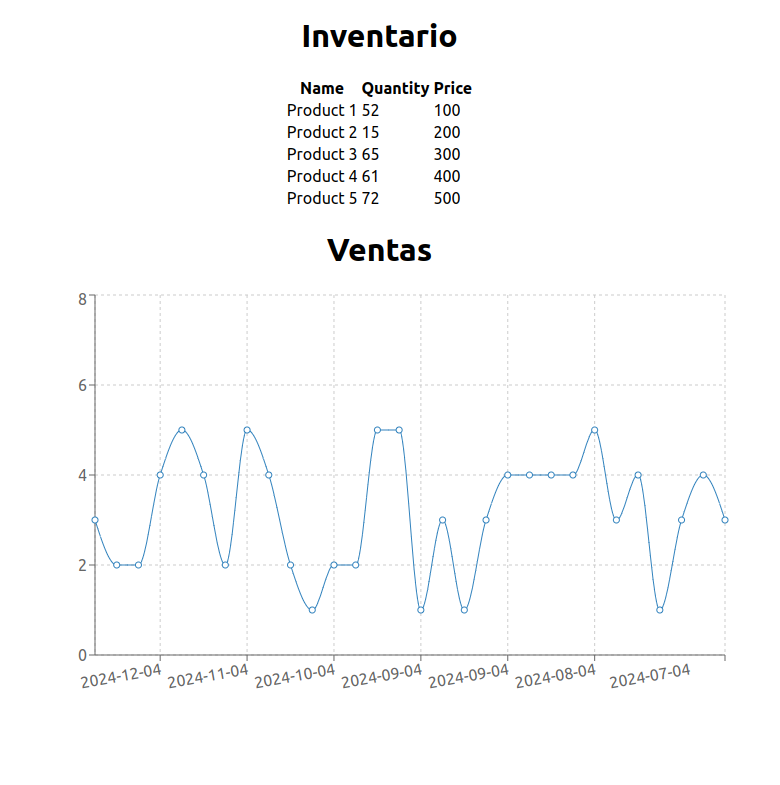

# Prueba tecnica 
## Lukas Vasqiez Verdejo

### Correr  el proyecto
Para correr el proyecto:
- setear las variables de entorno en el archivo .env, completando los campos vacíos:
```bash
# .env
DB_HOST= localhost
DB_USER= root
DB_PASSWORD= ''
DB_DATABASE= ''
DB_PORT= ''
```
- desde raiz :
```bash
# levanta la base de datos MySQL y el servidor
docker compose up
```
- desde api , poblar la base de datos:
```
node commands/populate.js
```
- desde api, instalar dependencias y levantar la api:
```bash
npm install 
npm start
```
- desde frontend, instalar dependencias y levantar el frontend:
```bash
npm install
npm start
```
### Arquitectura
La arquitectura del proyecto esta dividida en 3 partes:
- **db**: contiene la base de datos, desarrollada en MySQL, para lanzarla se debe ejecutar su contenedor con docker.
El modelo de datos contiene 4 tablas:
    - **Products(id,name,price)**: contiene la informacion de los productos.

    - **Sales(id, id_product, quantity,_date)**: contiene la informacion de los productos vendidos, esto es cantidad  de objetos vendidos por venta  y fecha de la transacción.

    - **Restocks(id,id_product,quantity,_date)**: contiene a información de los productos reabastecidos, considerando cantidad de objetos reabastecidos y fecha de la transacción.

    - **Inventory(id_product,quantity)**: contiene la informacion del  stock actual (asumí  que se debía  encargar de almacenar el stock actual, se puede refactorizar para almacenar histórico pero me iba a tomar bastante tiempo).

    - Nota: el modelo posee triggers para mantener la integridad de los datos, por ejemplo, al insertar una venta, se actualiza el stock en la tabla Inventory lo mismo con Restocks.

- **api**: contiene la api rest, desarrollada en nodejs con express, interacciona con la base de datos mediante un cliente  node para MySQL.Se implementa un CRUD para cada tabla descrita en db. Se añade un ejemplo de output en **media/api_output.json** .

- **frontend**: contiene la aplicacion web, desarrollada en react, hace llamados a la api  mediante peticiones http, ocupé la librería recharts para graficar las ventas y mostré el inventario en una tabla.


